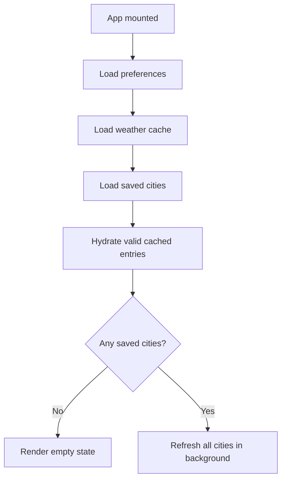

# Data Flow

## Startup

On mount, `src/App.vue` restores state in this order:

1. Load dashboard preferences from `src/lib/storage.ts`.
2. Load the persisted weather cache.
3. Load saved cities.
4. Hydrate in-memory weather state from cache when the record is still fresh and uses the current units.
5. If cities exist, refresh every city in the background.

This is why the UI can show cached weather immediately and then transition to fresh data without a blank reload.

## Search And Add City

`src/components/CitySearch.vue` owns the search box interaction only:

- debounces searches by 250ms
- aborts stale search requests
- keeps keyboard navigation state local
- emits `select` with a normalized `City`
- emits `locate` for current-location lookup

When `App.vue` handles `select`:

1. Clear any banner message.
2. Reject duplicates using `getCityKey(city)`.
3. Prepend the city to the saved list and persist it.
4. Pin the city if nothing is pinned yet.
5. Load weather for that city.

Current-location add follows the same path after browser geolocation and reverse geocoding succeed.

## Per-City Weather Loading

`loadWeatherForCity()` in `src/App.vue` is the critical workflow:

- one `AbortController` is tracked per city key
- a new request cancels the previous request for that city
- if a city already has successful data, refreshes mark it as `isRefreshing` instead of replacing it with `loading`
- fresh successful responses are written to both in-memory state and the persisted cache
- if a refresh fails but older successful data exists, the old data stays visible and the error becomes a `warning`
- if no successful data exists yet, failure becomes `status: 'error'`

## Refresh And Preference Changes

- `refreshAllCities()` runs `loadWeatherForCity(city, { background: true })` for every saved city.
- Changing temperature or wind units updates preferences first, then triggers a bulk refresh.
- Sort-mode changes update preferences only; they do not refetch weather.
- Pinning changes preferences only; it does not alter city order in storage.
- Toggling pinned-city board visibility (`showPinnedCityInGrid`) updates preferences and board rendering only; it does not refetch weather.

## Removal And Drawer Selection

- Removing a city aborts any active request for that city.
- The city is removed from saved cities, in-memory weather state, and persisted cache.
- If the removed city was selected in the drawer, the drawer closes.
- If the removed city was pinned, pinning falls back to the first remaining saved city or `null`.

Drawer state is intentionally small: `selectedCityKey` lives in `App.vue`, and `CityDetailsDrawer.vue` only renders the selected `city` and `weather` it receives.
